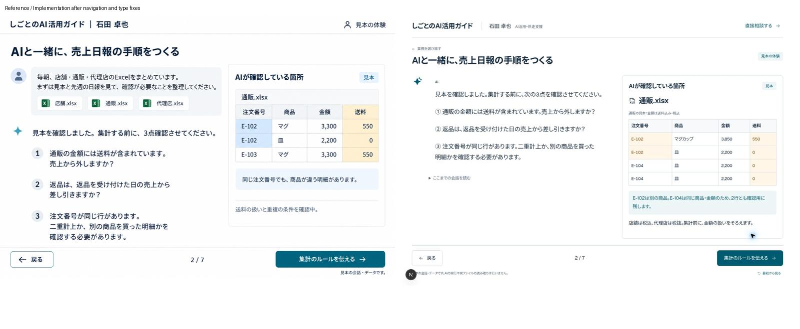
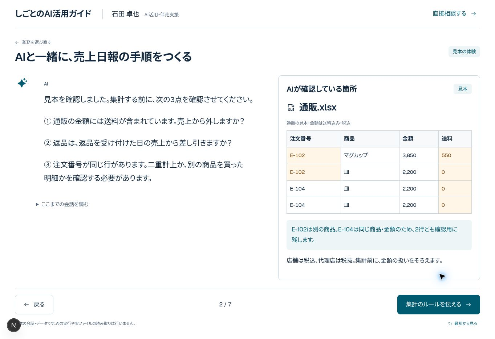

# Business skill demo — design QA

Status: **passed for the reviewed desktop and narrow-width layouts**.

## Design comparison

Reviewed the approved conversation mockup alongside the implemented screen. The desktop implementation retains the white background, navy text, teal action, conversation on the left, reference document on the right, and numbered previous/next controls. Full dialogue is split across seven scenes; previous dialogue remains available in a disclosure.

The source is 1536×1024 and the browser capture is 1363×936; the comparison normalizes their widths rather than claiming pixel-identical viewports. Existing site branding and computed sample figures intentionally differ. No generated screenshot is used as a UI asset.

## Findings and fixes

- Fixed: the existing bottom tour navigation competed with the demo's next button. It is hidden during the demo, with a visible return-to-selection control retained.
- Fixed: increased conversation typography to match the approved reading experience.
- Checked: at a 390×844 iframe viewport, content flows vertically and document scroll width equals client width (375px after scrollbar). Conversation and reference material remain readable without horizontal page overflow.
- Checked: sales conversation, all three confirmation checkboxes, retained checks after Back, skill-save simulation, 09:30 next-morning preview, pricing, and selected-scenario handoff to the disabled contact form.
- Checked: expense and inquiry conversations advance through their seven scenes; inquiry reaches the saved-skill preview.
- Reduced motion has a zero-delay replay and disables CSS entrance animation; the automated regression cases request reduced motion.

## Validation and limits

`npm run typecheck`, `npm run lint`, and `npm run build:export` passed. The browser-free sample calculation test passed (tax, shipping, returns, duplicates, and matching totals). E2E specifications were updated; the full automated browser suite has not been run locally. Mobile review uses a narrow iframe, not a physical device. Safari and Firefox remain untested. Browser-extension metadata errors appeared in the browser console and are unrelated to the application.
